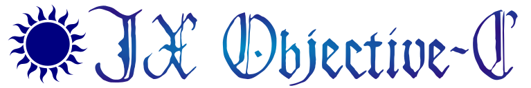

# JX Objective-C #

### Overview ###

This is **JX Objective-C**. JX Objective-C is a powerful development suite
for working with the *Objective-C* language. It is a branch of David Stes'
*Portable Object Compiler*.

It provides several components: firstly, a compiler, which includes support for
novel functionality like *Blocks* (which are an implementation of closures or
the lambda expressions).

A standard library is also provided, **Object Kit**. This provides powerful
functionality for writing portable software, and is designed to allow the
programmer to leverage the strengths of multiple paradigms, with native
features allowing working in a reactive, object-oriented, and functional manner
The Object Kit containers subsuite is derived from the design of *IC-Pak 101*
of Stepstone. It is very similar in operation and API to the containers found
in *Smalltalk-80*'s famously acclaimed standard library.

A variety of other libraries are also available; one of these is **CAkit**, the
*Computer Algebra Kit*, which provides classes allowing multiple precision
arithmetic and polynomial mathematics. CAkit is designed for the Portable
Object Compiler but, as JX Objective-C Compiler is a derivative of this, it
will work here, too. You can find David Stes' website, offering the POC and
CAkit, through this [link](http://users.telenet.be/stes/).

### Compiling ###

Instructions are available in `doc/compile` detailing compilation on various
platforms. In general, the process simply involves running `kmk`.

Before you can build the JX Objective-C compiler, you will need to build and
install the bootstrap package. This is available in the **Releases** section of
the GitHub page.