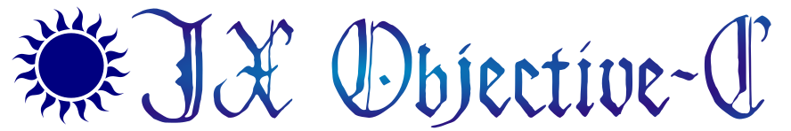
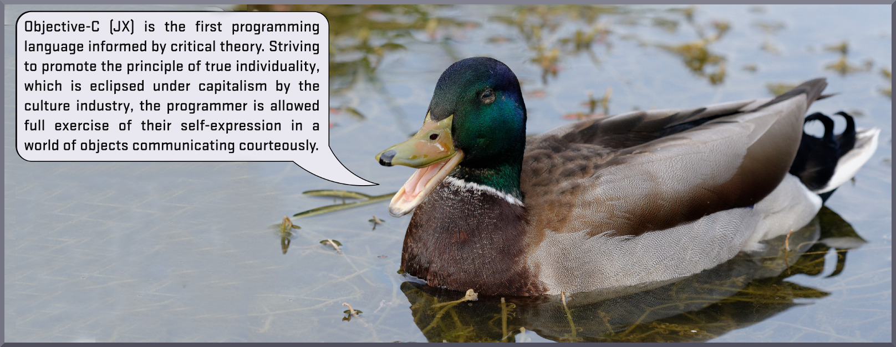

[](https://travis-ci.org/Objective-C-JX/JXobjC)
[](https://github.com/Objective-C-JX/JXobjC/releases)


### Overview ###



**JX Objective-C** is a powerful development suite implementing the programming
language Objective-C *(JX)* (abbreviated **JXobjC**.) It is a derivative
project of David Stes' *Portable Object Compiler*, and is the reference
implementation of the JXobjC language.

JX Objective-C several components: firstly a compiler, `jxobjc`, which provides
a complete implementation of the Objective-C *(JX)* language, and which is
itself written in JXobjC. The compiler assists the programmer-user, and is
designed to act as a friend and assistant, offering clear explanations when an
issue is encountered.

A standard library, **Object Kit**, forms the second component. This provides
a class library equipped with a comprehensive world of objects, allowing the
creation of powerful programmes and libraries. Classes are provided for working
with containers, threads, messaging, networking, and more.
The Object Kit containers subsuite is derived from the design of the
*IC-Pak 101*, the standard library for the historic Stepstone Objective-C. The
overall design of the Object Kit is informed primarily by that of
*SmallTalk-80*'s famously acclaimed standard library.

### Language ###

Objective-C *(JX)* is a programming language in the *Kayian School* of
object-orientation. It bears most similarity to SmallTalk-80, often considered
to be the pinnacle of programming language design.

JXobjC is founded upon a humanist, modernist, and universalist philosophy, and
is unapologetically Object-Oriented in the Kayian sense, with a capital **O**.
Read about the philosophy of JXobjC [here](doc/Philsphy.md).

The language provides a variety of features. You can read about these in the
eBook,
["The Programming Language Objective-C *(JX)* and Its Implementation `jxobjc`"]
(doc/Book.md) which is linked. Some features of JXobjC include the following:
- C basis, allowing inlining of C code as desired.
- Blocks, similar to the lambda expressions of the functional languages:

  ```objective-c
  Block * aBlk = { :aParam | printf("%s\n", [aParam str]) };
  [aBlk value:@"Hello, world!"];
  ```

- Dynamic or static typing as desired, with static typing permitting the
  compiler to assist the programmer-user by pointing out seemingly-inappropriate
  assignment and sending of messages.
- Lightweight Generics, which allow the advisory warnings in the context of
  classes such as containers that may be asked to warn when an object of another
  type is passed to a method.
- Garbage collection (with Boehm LibGC), freeing the programmer-user from the
  today-needless concern that is manual memory management.
- Powerful introspection and reflection - even a class' message responders may
  be swapped or altered at runtime.
- Expressive messaging syntax, designed to imitate conversion:

  ```objective-c
  [theShop pleaseSellMe:@"A box of chocolate" for:[myWallet takeFivePounds]];
  ```

- Kayian late-binding, which permits even such features as forwarding a message
  between objects, which is used to practical benefit in Object Pak's
  `AtomicProxy` class (this activates a lock around all messages sent to an
  object from different threads.)

### Compiling ###

Instructions are available in [doc/Build.md](doc/Build.md) detailing compilation
on various platforms. If building presents issues for you, please report this as
a GitHub issue on this repository.
